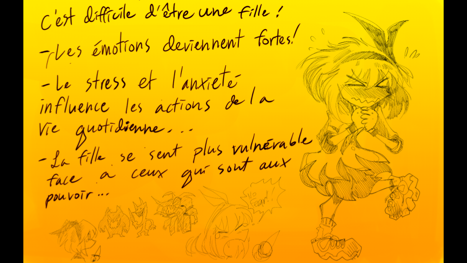

# Préproduction
> C'est ici qu'on dépose les éléments de la préproduction.

# Table des matières
1. [Intention ou concept](#Intention-ou-concept)
    - [Cartographie](#Cartographie)
    - [Intention de départ](#Intention-de-départ)
    - [Synopsis](#Synopsis)
    - [Scénario, scénarimage ou document audio/visuel](#Scénario,-scénarimage-ou-document-audio/visuel)
2. [Contenu multimédia à intégrer](#Contenu-multimédia-à-intégrer)
    - [Inventaire du contenu multimédia](#Inventaire-du-contenu-multimédia)
3. [Planification technique d'un prototype (devis technique)](#Planification-technique-(devis-technique))
    - [Schémas ou plans techniques](#Schémas-ou-plans-techniques)
    - [Équipements requis](#Équipements-requis)
    - [Logiciels requis](#Logiciels-requis)
    - [Ressources humaines requises](#Ressources-humaines-requises)
    - [Ressources spatiales requises (rangement et locaux)](#Ressources-spatiales-requises-(rangement-et-locaux))
    - [Contraintes techniques et potentiels problèmes de production](#Contraintes-techniques-et-potentiels-problèmes-de-production)
4. [Planification de la production d'un prototype (budget et étapes de réalisation)](#Planification-de-la-production-(budget-et-étapes-de-réalisation))
    - [Échéancier global](#Échéancier-global)
    - [Liste des tâches à réaliser](#Liste-des-tâches-à-réaliser)
    - [Rôles et responsabilités des membres de l'équipe](#Rôles-et-responsabilités-des-membres-de-l'équipe))

# Intention ou concept
## Cartographie

## Intention de départ
Faire un jeu d'aventure et clic facile a acceder et a jouer pour les adolescants et les jeunes adultes.

## Synopsis
Zodie Gal projet est un jeu web de touche et aventure où il faut aider une jeune fille à trouver des moyens de tuer des monstres Zodiac en cliquant sur le bon objet d’une image. Il y a 12 niveaux au total(baser sur le zodiac). Chaque niveaux contient 2 images: une image pour trouver le bon objet à utiliser contre le Zodiac et une image qui montre la victoire au joueur face au Zodiac.

## Scénario, scénarimage ou document audio/visuel
.png)

C'est difficile d'etre une fille!
- Les emotions deviennent fortes!
- Le stress et l'anxiete influence les actions de la vie quotidienne...
- La fille se sent plus vulnerable face a ceux qui sont au pouvoir...

Le zodiac
- Dans la culture feminine; dans les magazines pour filles,ont retrouve souvent des sections portant sur des quiz ou meme des descriptions portant sur les signes du Zodiac
- Le zodiac est utilise pour decrire la personalite, leur amoureux, leur ami.
- Une fille,voulant etre aime par les autres se voudrait d'imiter les descriptions de son signe.

- Par force, sa personalite change dependanment de ces descriptions
- Elle ne sait plus comment etre honnete avec elle-meme ou avec les autres.
- Comme une poupe, elle change d'apparence en se basant du contexte de la situation.

A fight against Itsself!!

Ecran de commencement

Ecran de commencement (quand ont a fini le jeu 100%)

# Contenu multimédia à intégrer
## Inventaire du contenu multimédia
- Les sketch
- Les dessings de backgrounds
- Les dessings des objets specifique

# Planification technique d'un prototype (devis technique)
## Schémas ou plans techniques

## Équipements requis

* Ordinateur
* Tablette
* Projecteur de lumiere(si possible)

## Logiciels requis
* CLIP PAINT STUDIO
* GDEVELOP 5

## Ressources humaines requises
* 1 personne (moi, Yara Abdanor)

## Ressources spatiales requises (rangement et locaux)
* Petit espace pour la version ordinateur de bureau et QR code(mobile).

## Contraintes techniques et potentiels problèmes de production

| Contrainte ou problème potentiel 
- 1. trouver un facon de cacher l'opaciter de la reponce dans la scene
- 2. Le QR Code ne marche pas.

| Solution envisagée   
- 1.Separer l image de  l objet
- 1.2 Faire un png
- 2. Publier le jeu sur Liluo.io et demander au visiteurs de créer un compte Gdevelop gratuit pour jouer au jeux.
- 2.2 Donner un lien Web.

| Commentaires   
- 1.L'engin peut supporter les png

# Planification de la production d'un prototype (budget et étapes de réalisation)

## Échéancier global
Étapes importantes du projet visualisé dans GitHub (*milestones*):  
https://github.com/tim-montmorency/66B-modele_de_projet/milestones

*Dates importantes :*

- 2022-12-12 V.0.0.1 (BETA) : https://yarata.itch.io/zodie-gal password:zodie-gal-momo

## Liste des tâches à réaliser
- Creer prototype du jeu dans GDEVELOP 5

Inventaire des tâches à réaliser dans GitHub selon le répertoire d'*issues*:  

## Rôles et responsabilités des membres de l'équipe
- Yara Abdanor: dessins et programmation du jeux.
